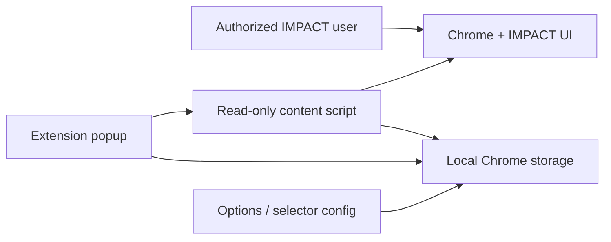
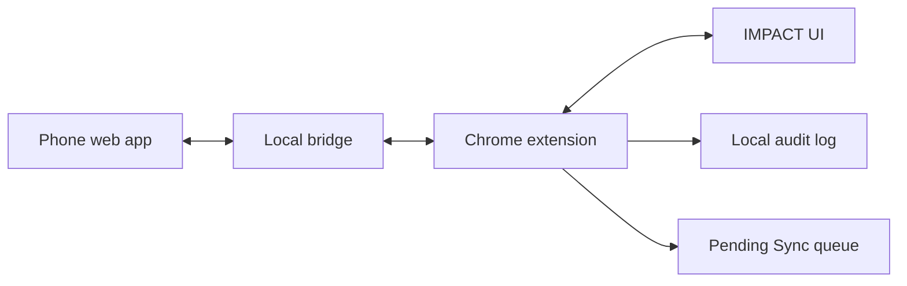

# Architecture

## Principle

IMPACT remains the official system of record. The extension and future phone web app are a faster companion interface that must verify IMPACT accepted any future update before marking it synchronized.

## Stage 1: Diagnostic Only

- Content script is injected on demand through `activeTab`.
- Origin allowlist blocks collection on unrelated sites.
- Selectors live in extension storage and `src/shared/selector-config.js`.
- Logs live locally in Chrome storage.

## Later Stages

Planned but not built yet:

- local phone bridge
- rolling lead prefetch cache
- command queue
- verified IMPACT write-back
- pending sync recovery
- callbacks and appointments
- approved AI note drafts
- call statistics

## Folder Layout

- `extension/manifest.json`: Manifest V3 entrypoint.
- `extension/src/content/`: read-only IMPACT page diagnostics.
- `extension/src/popup/`: toolbar UI.
- `extension/src/options/`: origin and selector configuration.
- `extension/src/shared/`: shared storage keys and default selector config.
- `docs/`: workflow and architecture notes.
- `phone-web/`: placeholder for the future phone interface.

